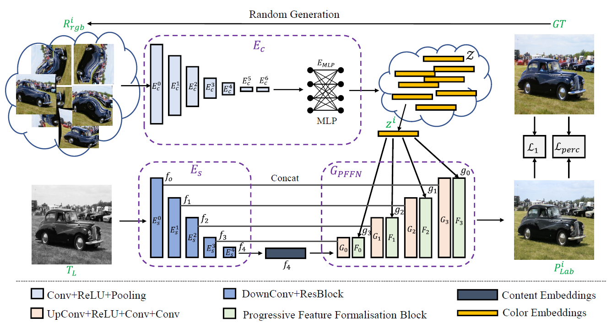
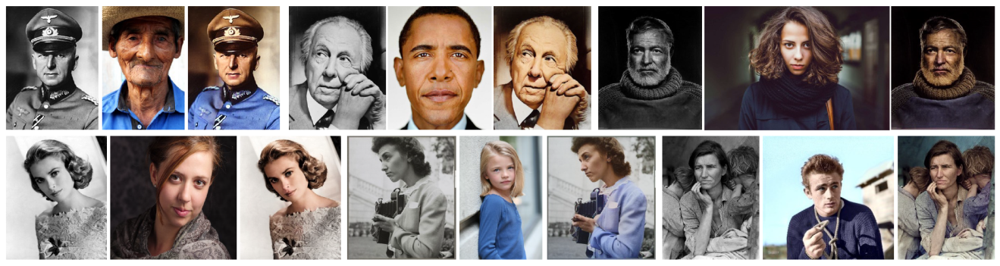
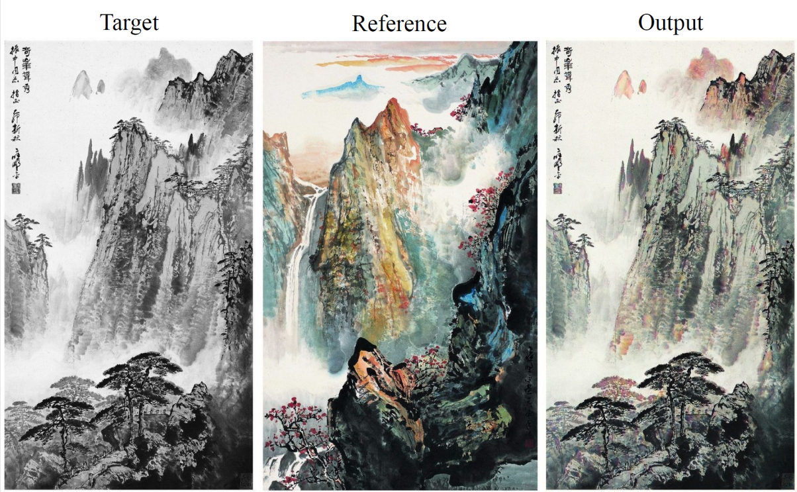

# Color2Embed
Color2Embed: Fast Exemplar-Based Image Colorization using Color Embeddings [Paper](https://arxiv.org/abs/2106.08017)

## abstract
In this paper, we present a fast exemplar-based image colorization approach using color embeddings named Color2Embed. Generally, due to the difficulty of obtaining input and ground truth image pairs, it is hard to train a exemplar-based colorization model with unsupervised and unpaired training manner. Current algorithms usually strive to achieve two procedures: i) retrieving a large number of reference images with high similarity for preparing training dataset, which is inevitably time-consuming and tedious; ii) designing complicated modules to transfer the colors of the reference image to the target image, by calculating and leveraging the deep semantic correspondence between them (e.g., non-local operation), which is computationally expensive during testing. Contrary to the previous methods, we adopt a self-augmented self-reference learning scheme, where the reference image is generated by graphical transformations from the original colorful one whereby the training can be formulated in a paired manner. Second, in order to reduce the process time, our method explicitly extracts the color embeddings and exploits a progressive style feature Transformation network, which injects the color embeddings into the reconstruction of the final image. Such design is much more lightweight and intelligible, achieving appealing performance with fast processing speed.

<p align="left">
  
</p>

## Dependencies

- Python >= 3.6 (Recommend to use [Anaconda](https://www.anaconda.com/download/#linux))
- [PyTorch >= 1.5.0](https://pytorch.org/)

## Test
1. Clone this github repo. 
```
git clone https://github.com/zhaohengyuan1/Color2Embed.git
cd Color2Embed
```

2. Pretrained models should be Downloaded in `./experiments/` folder. The model will be uploaded.

3. Run the test.gray2color.py

```
python test.gray2color.py
```

## Train

1. Prepare the training data

```
cd data
sh prepare_data.sh
```

1. Run the train.sh

```
sh train.sh
```

## Results

<p align="left">
  
</p>

<p align="left">
  
</p>

If you find our work is useful, please kindly cite it.
```
@misc{zhao2021color2embed,
      title={Color2Embed: Fast Exemplar-Based Image Colorization using Color Embeddings}, 
      author={Hengyuan Zhao and Wenhao Wu and Yihao Liu and Dongliang He},
      year={2021},
      eprint={2106.08017},
      archivePrefix={arXiv},
      primaryClass={cs.CV}
}
```

